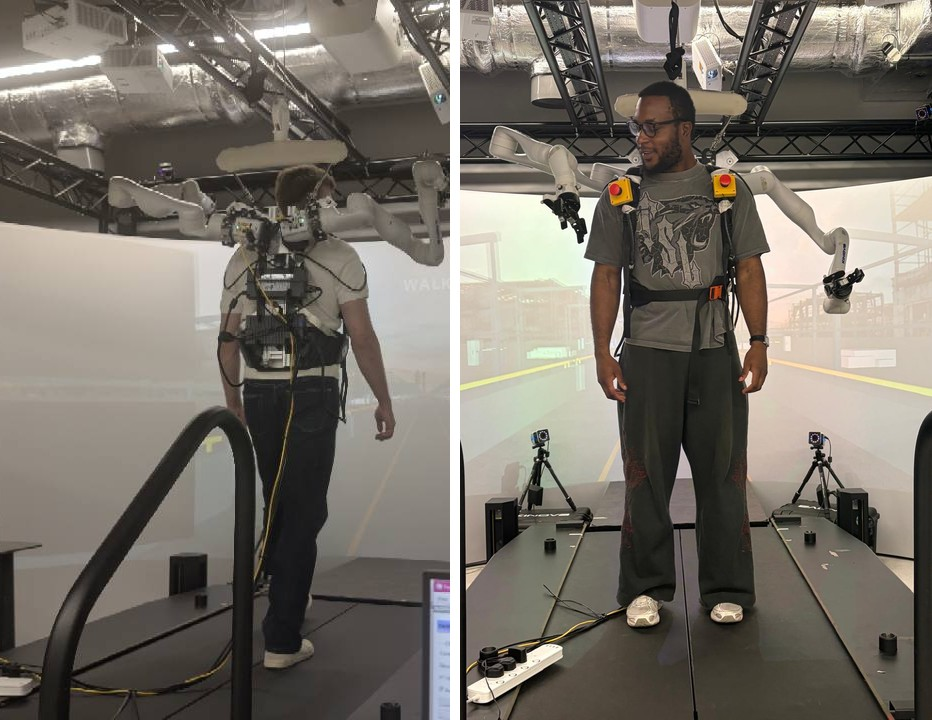
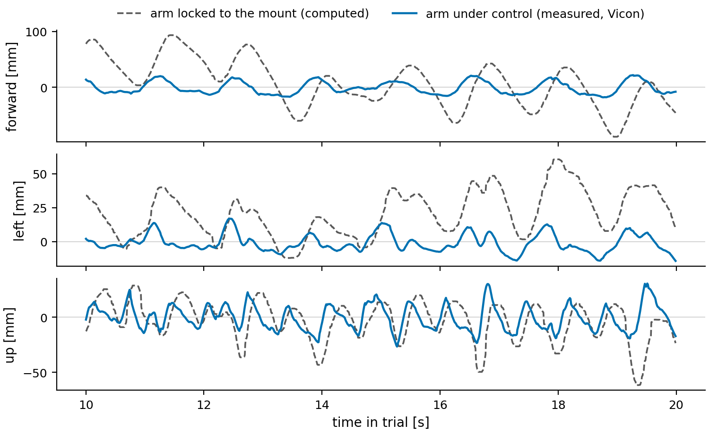
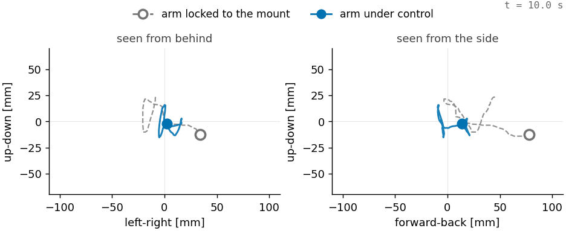
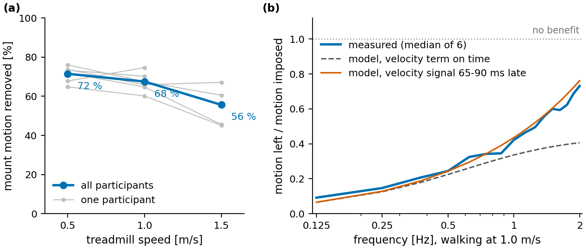
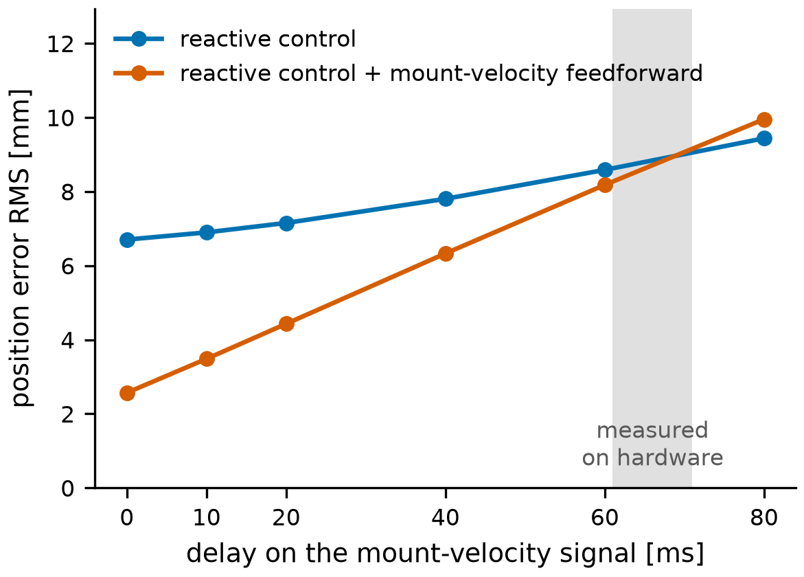
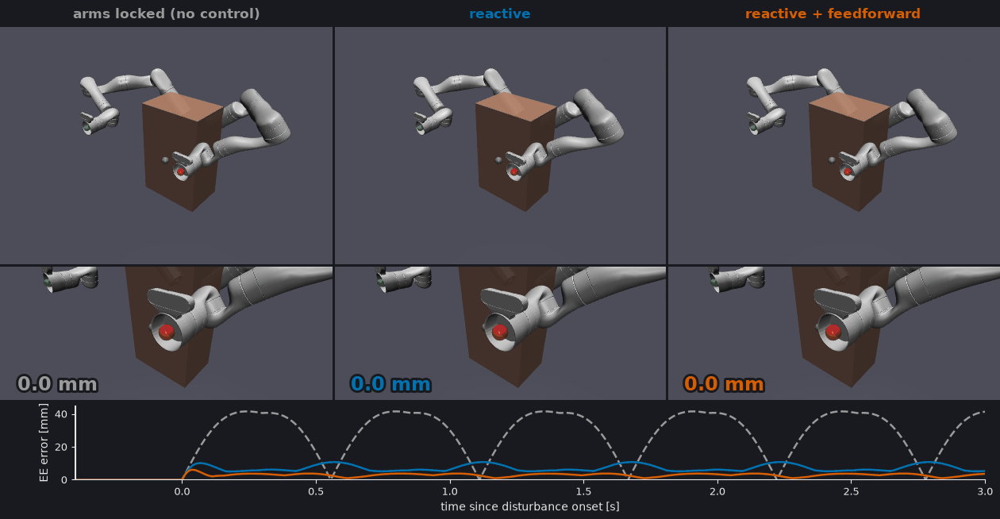
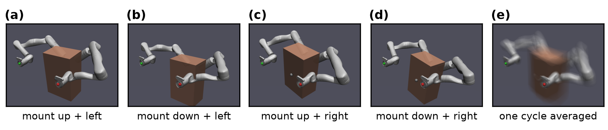
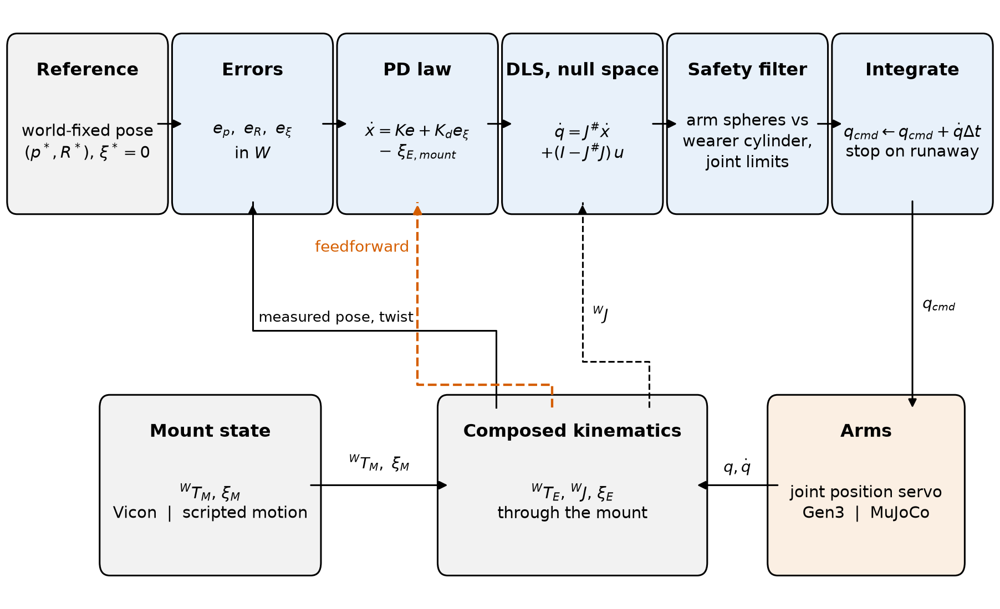
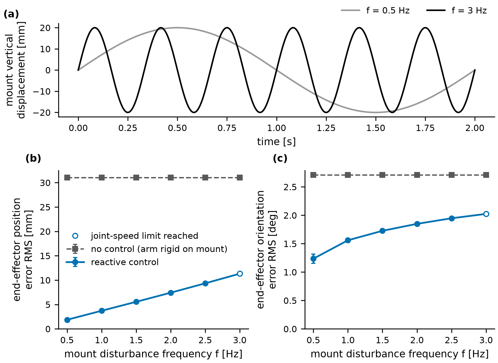

# Holding a robot's hand still while its wearer moves

Christian Akabueze · MSc Human and Biological Robotics, Imperial College London (MUVE Lab) · 2026

Two Kinova Gen3 arms are worn on the torso as extra limbs. When the wearer walks, the mount on their back bounces and sways, and anything the arms hold moves with it. My MSc project asked how much of that motion the arms can cancel, so their end-effectors (the "hands") stay fixed in the room rather than on the body.



*The rig. Left: a participant walking on the treadmill with both arms on. Right: the same rig from the front. Vicon cameras on the truss and on tripods track the mount and the end-effectors.*

**On hardware**, six participants walked on a treadmill while the arms, mostly one at a time, held a fixed point in the room. The arm removed 72% of the mount motion at 0.5 m/s, 68% at 1.0 m/s and 56% at 1.5 m/s. What it missed was mostly fast motion. The controller's velocity term (a gain K_d on the world-frame velocity error, which should damp the mount's motion) did far less than it should, and the mount-velocity signal it relies on reached the arm 60-70 ms late.

**In simulation**, where that signal is exact, the same K_d term lowers the error at 1.8 Hz from 7.5 to 6.7 mm, and adding mount-velocity feedforward (a term the hardware controller did not use) brings it to 2.6 mm. Delay the signal by 60 ms, about what the hardware measured, and both benefits are gone: 8.6 mm with the K_d term alone, 8.2 mm with feedforward. So the next thing I would change on hardware is the velocity estimate, not the control law.

This repo is the MuJoCo simulation and controller I built for the project ("World-Stable Supernumerary Effectors for Human Augmentation Under Locomotion-Based Motion"), plus the scripts behind the hardware figures. The arm model is from MuJoCo Menagerie; the controller, safety filter, experiments and C++ port are mine.

## Hardware trials

Six participants wore the arms on an instrumented treadmill and walked at 0.5, 1.0 and 1.5 m/s (four of them at 1.5 m/s). Five also stood on the treadmill platform while it pitched and swayed. A seventh session had a fault in the mount tracking and is left out of the pooled numbers. Most trials ran one arm at a time (19 of 128 walking trials had both arms servoing), so these are one-arm results.

The arms ran a 400 Hz world-frame Cartesian controller, with a Kalman filter estimating the mount pose and velocity from Vicon. It had no mount-velocity feedforward; its velocity term was the K_d gain on the world-frame velocity error. That controller is a separate codebase and is not in this repo. The analysis is mine. Participant data are not public, so the repo has the figures and the scripts that drew them (`tools/hardware_figures.py`, `tools/hardware_replay.py`), not the data.

To score a trial I compare two things: where Vicon saw the end-effector go, and where it would have gone if the arm were locked to the mount. The second is computed by carrying the end-effector point along with the measured mount pose. That model checks out: on arms that were not being controlled, it predicts their motion to within 0.5% (median over 126 arms). The ratio of the two motions is the share of mount motion left over.



*One trial at 1.0 m/s, 10 s of it (participant P6, left arm; of that participant's trials, the one closest to their median). Dashed: the end-effector if the arm were locked to the mount, lightly median-filtered for display. Solid: the end-effector as measured. Both are centred on their mean over the trial, so the constant offset to the goal (see below) is removed. All three panels share one scale.*

In this trial the forward and sideways sway, which repeat once per stride, are mostly cancelled. The vertical bounce, which comes twice per stride, is cancelled much less. Here are the same 10 s replayed at real speed:



*Hollow grey: the end-effector if the arm were locked to the mount (median-filtered, as above). Blue: the end-effector as measured. Tails show the last second.*

Across participants the frequency response shows the same split:



*(a) Share of mount motion removed over the whole trial, by treadmill speed. (b, c) Amplitude and phase of the motion left over relative to the motion imposed, at 1.0 m/s, median of 6 participants. Green: the logged gains with the mount-velocity signal late by a delay fitted per participant (65-90 ms); with the measured 61-71 ms and nothing fitted, the curve is almost the same (complex error 0.15 against 0.13). Above 2 Hz the locked-arm estimate is not accurate enough to interpret.*

At 1.0 m/s the arm cancels about 85% of the motion below 0.5 Hz but only about 25% at 2 Hz. Around the constant offset, the end-effector moved 16-17 mm RMS at 0.5 and 1.0 m/s (five participants) and 20-39 mm at 1.5 m/s, depending on the participant (three participants). Standing on the tilting and swaying platform it stayed within 9-12 mm RMS while the locked point moved 64-68 mm (exploratory, five participants).

### What limited it

- **The velocity term did far less than the model predicts.** With the logged gains, the ideal model (dash-dot in b and c) predicts much better rejection above 0.5 Hz than the arm achieved. The same model with no velocity term (dotted) matches the amplitude. In a pilot session with one wearer, K_d was stepped from 0.8 to 2.6: the response near 1 Hz fell by 9%, where the model predicts 38%.
- **One account that fits: the mount velocity arrives late.** The Kalman estimate that feeds the velocity term lags the mount's motion by 35-50 ms. Adding the sensing age (about 10 ms) and the joint response time (about 15 ms) gives 61-71 ms in total. With that measured delay and nothing fitted, the model reproduces the response in amplitude and phase, better than the no-velocity-term model in 6 of 6 participants; the two differ mainly in phase (c, which shows the fitted version). This is an account, not a proven cause: no trial changed the estimator.
- **Re-planning.** The worst holding came when the hardware controller's motion planner moved the arm's internal target mid-trial (18 of 181 arms). The arm followed the moved target as well as usual; the target itself moved. Those arms kept 66% of the mount motion against 31% for the rest.
- **Absolute accuracy is set by calibration.** Each arm sat a constant 13-36 mm from its goal. That offset matches the disagreement between the arm's kinematic model and Vicon, so it is calibration, not control: the controller saw itself on target to within 1 mm.

## Simulation

The hardware left one question open: if the mount velocity arrived on time, how much would the velocity terms help? In simulation the velocity is exact, and I can delay it on purpose.

### A late velocity signal

`tools/velocity_delay.py` runs the disturbance below at f = 1.8 Hz and delays the mount part of the measured end-effector velocity by up to 80 ms before the controller sees it. The arm's own part (J q̇) stays current, as on hardware. Three controllers: no velocity term, the K_d term alone (as on hardware), and the K_d term plus feedforward. Feedforward is a simulation-only term: the controller subtracts the end-effector velocity the mount causes from its command, so the arm cancels the mount's motion as it happens instead of correcting the error it leaves.



*Right arm at f = 1.8 Hz. Grey band: the 61-71 ms measured on the hardware's mount-velocity path.*

With the exact velocity, the K_d term alone gives 6.7 mm against 7.5 mm with no velocity term, and feedforward brings it to 2.6 mm. Each 10 ms of delay costs the feedforward about 1 mm. Past about 30 ms the K_d term does worse than no velocity term at all; past about 45 ms the feedforward does worse than the K_d term with an exact velocity. At 60 ms both sit at 8.2-8.6 mm.

Why a delay does this much damage: an estimate that is d seconds late cancels the true velocity only up to a phase error, and what is left over is |1 − e^(−jωd)| = 2 sin(ωd/2) of it. At 1.8 Hz and 60 ms that is two thirds; at 0.9 Hz, a third. For the feedforward, which only cancels, that fraction depends on frequency and delay alone; the K_d term sits inside the feedback loop, so how much a delay costs it also depends on the gains. In the simulation it ends up slightly worse than no velocity term, where the hardware response sits about at the no-velocity-term model; the simulated gains are stiffer. The simulation does not prove the hardware diagnosis, but it shows that a delay of the size measured there is enough to remove the benefit of a velocity term.

### How the simulation works



*Same mount motion in all three columns (f = 1.8 Hz, true amplitude). Top: the whole robot. Middle: a camera fixed in the world at the left arm's target (red sphere). Number: RMS position error of the worse arm since the disturbance started (the clip is 2.3 s including the onset transient; the full 8 s values are 31.0, 6.7 and 2.6 mm). Strip: that arm's instantaneous error; dashed grey is arms locked. [MP4](media/hold_pose.mp4)*

With the arms locked, the end-effectors move with the mount: 31 mm RMS position error. The reactive controller (the PD law with the K_d term, no feedforward) removes 94% of that at 0.5 Hz and 63% at 3 Hz.

The mount is a mocap body standing in for the wearer's torso. Both arms are kinematic children of it, and each end-effector has a target pose fixed in the world frame. The mount follows one sinusoid per axis. The amplitudes are hand-chosen to look like walking (a few centimetres of bounce and sway, a few degrees of rotation); this is not a gait model. Bounce, fore-aft and pitch run at f; lateral sway, roll and yaw at f/2, once per stride, as in walking.

| axis | amplitude | frequency |
|---|---|---|
| x (forward) | 8 mm | f |
| y (left) | 22 mm | f/2 |
| z (up) | 20 mm | f |
| roll | 2° | f/2 |
| pitch | 1.3° | f |
| yaw | 3° | f/2 |

Only f changes between runs; the amplitudes stay fixed, so the sweep measures controller bandwidth rather than faster walking. The arms first settle on the static mount, then the disturbance runs for 8 s of simulated time at a 500 Hz control rate. (The Python loop does not run in real time: about 3 ms per cycle.)



*Reactive controller on. Four extreme mount poses of one cycle, and (e) the average over the cycle: the mount and the proximal links blur, the end-effectors stay sharp. The mount motion is enlarged 3x here so it shows in a still; all numbers use the true amplitudes.*

#### Controller



*Left of each "|": what a hardware backend would use (this controller has not run on hardware). Right: simulation.*

Per arm, every 2 ms:

1. Compose the end-effector pose and Jacobian through the mount: world → mount → arm base → end-effector. The pose is never read from MuJoCo directly; on hardware the same code would take the mount pose from Vicon and the joint angles from the encoders.
2. A PD law on the world-frame pose and twist error gives a task-space velocity. Feedforward, when on, adds the negated mount-induced end-effector velocity (the measured total minus the arm's own J q̇).
3. Damped least squares maps it to joint velocities, with a null-space term that pulls the joints toward mid-range.
4. A safety filter keeps 13 spheres per arm outside a cylinder around the wearer. Each sphere gets a barrier-style constraint on its distance rate. If the requested joint velocity violates any of them, OSQP finds the closest joint velocity that satisfies all of them and the joint speed and position limits ([docs/human-safety.md](docs/human-safety.md)).
5. Integrate to a joint position command for the position servos.

The safety filter never activated in the runs here, so it does not affect the results. The gains are stiffer than on hardware (K_p = 32 s⁻¹ and K_d = 0.9 here; 12 s⁻¹ for most hardware arms, range 10-16, with K_d 1.0-1.6), so compare trends between the two, not millimetres.

#### Frequency sweep

Position and orientation error RMS over 8 s, worse of the two arms. Locked arms: 31.0 mm and 2.71° at every f.

| f (Hz) | position, reactive (mm) | removed | orientation, reactive (°) | removed | peak joint speed (°/s) |
|---|---|---|---|---|---|
| 0.5 | 1.9 | 94% | 1.24 | 54% | 14 |
| 1.0 | 3.7 | 88% | 1.56 | 42% | 27 |
| 1.5 | 5.6 | 82% | 1.73 | 36% | 40 |
| 2.0 | 7.4 | 76% | 1.85 | 32% | 52 |
| 2.5 | 9.3 | 70% | 1.95 | 28% | 66 |
| 3.0 | 11.3 | 63% | 2.02 | 25% | 80 |



*(a) Vertical mount motion in the slowest and fastest run. (b, c) End-effector error against disturbance frequency. Error bars: SD of the per-period RMS across the complete periods in each run. Open marker: joint-speed limit reached (16% of samples at 3 Hz).*

Position error grows roughly linearly with f, as on hardware. Ignoring servo lag, each position axis is first order: (1 + K_d) ė + K_p e = −v, where e is the end-effector position error and v the velocity the mount imposes on it. With K_p = 32 s⁻¹ and K_d = 0.9 the time constant is 59 ms (corner 2.7 Hz). Below the corner the error is roughly v / K_p, and v grows with f.

Orientation does worse: 54% removed at 0.5 Hz, 25% at 3 Hz. At 1.8 Hz the rotational gain K_R (2.1 s⁻¹) is not the limit: raising it to 12 s⁻¹ only moves the error from 1.79° to 1.69°, and at 16 s⁻¹ the loop goes unstable. Raising every joint servo's gain 4x does more (1.39° with K_R = 8), which points at servo lag. The wrist servos in the Kinova model are a quarter as stiff as the others, but I have not isolated which joints matter.

Feedforward with the exact velocity also cuts orientation error at 1.8 Hz, from 1.79° to 1.25°, and the left arm gives the same position numbers as the right to within 0.1 mm (`tools/feedforward_compare.py`). The 2.6 mm it leaves is mostly the position servos lagging the command: with the servo gains raised 4x it drops to 1.1 mm.

## C++ port

`cpp/` is a C++20 port of the simulation and controller. On the current config it reproduces the Python golden trace (250 control cycles, both arms, safety filter off) to within 2.4e-12, trajectory sampling matches to 1e-12, its effective config print is byte-identical, and its 10 unit-test suites pass (`bash cpp/tools/verify_parity.sh`). It predates the feedforward term and does not include it. A 2,000-cycle comparison with the safety filter engaged passed when the port was written ([cpp/docs/04-parity-report.md](cpp/docs/04-parity-report.md)) but no longer runs, because the Python trace format changed afterwards.

## Limitations

- Hardware: six participants, four at 1.5 m/s, mostly one arm at a time, with speed not randomised. The late-velocity account fits the data but was not tested by changing the estimator.
- The feedforward term has only run in simulation.
- The simulated disturbance is a hand-chosen sum of sinusoids, not recorded gait. It is periodic and smooth, which flatters any controller.
- The simulated delay is a pure delay on an otherwise exact signal. The hardware estimate also has noise and filtering.
- Joint limits are clamped, not avoided. From a start far from the target (about 24 cm) one arm can drive a wrist joint onto its limit and stall there.
- The simulated arms are position-servoed and rigid: no link flexibility or backlash beyond what MuJoCo models.
- The thesis proposed predictive control (MPC) against this baseline. I did not build it; this repo is the baseline plus the feedforward term.

## Code

| Path | |
|---|---|
| `controller/reactive_controller.py` | The control law in order: errors, PD, feedforward, DLS, null space, safety projection |
| `controller/frames.py`, `pin_fk.py` | World-frame kinematics composed through the mount (Pinocchio FK) |
| `controller/human_safety.py`, `link_spheres.py` | Arm spheres, the wearer cylinder and the distance constraints |
| `controller/runner.py`, `servo.py` | One control cycle; MuJoCo and a future Kinova hardware backend share one interface ([docs/backend-contract.md](docs/backend-contract.md)) |
| `sim/` | MJCF scene, MuJoCo backend |
| `tools/mount_disturbance.py` | The disturbance model, and a viewer that runs it |
| `tools/velocity_delay.py` | Error against delay on the mount-velocity signal |
| `tools/disturbance_freq_sweep.py` | Frequency sweep (results table and figure) |
| `tools/feedforward_compare.py` | Reactive vs feedforward, error over time |
| `tools/gain_sweep.py` | Kp × Kd sweep behind the chosen position gains |
| `tools/make_readme_media.py` | The simulation video |
| `tools/hardware_figures.py`, `hardware_replay.py` | The hardware figures and replay (need the thesis data, not included) |
| `analysis/` | FK against MuJoCo, end-effector velocity ([docs/velocity-validation.md](docs/velocity-validation.md)), tracking bandwidth, live dashboard |
| `tests/` | 258 unit and closed-loop tests |

Also in the repo, not used for the results: Cartesian target trajectories, including look-at orientation targets ([docs/cartesian-trajectories.md](docs/cartesian-trajectories.md)) and a collision-aware path planner above the controller (`planning/`, [docs/planning.md](docs/planning.md)).

Two FK implementations exist on purpose: `pin_fk.py` (Pinocchio) is the control path, `kinematics.py` (analytical, from MuJoCo model constants) cross-checks it. Frames are written `T_A_B`: pose of frame B in frame A. Everything is SI internally; millimetres only in prints and plots. In the code the mount is also called the torso (`torso_pose_world`).

## Running

Tested on Python 3.14.4 with `mujoco`, `pin`, `numpy`, `scipy`, `osqp`, `matplotlib` (`requirements.txt`; pinned versions in `requirements-lock.txt`). Run from the repo root.

```bash
python -m venv .venv && source .venv/bin/activate
pip install -r requirements.txt

mjpython tools/mount_disturbance.py both   # viewer at f = 1.8 Hz (mjpython on macOS)
python tools/velocity_delay.py             # delay figure, about 4 minutes
python tools/disturbance_freq_sweep.py     # results table and sweep figure
python tools/feedforward_compare.py right --f=1.8
python tools/make_readme_media.py          # the simulation video
python -m unittest discover tests
```

Gains, limits, targets and the safety envelope are in `config/control.toml`. The Kinova Gen3 model in `sim/assets/kinova_gen3/` is from MuJoCo Menagerie (BSD licence, Kinova). My code is MIT licensed.
