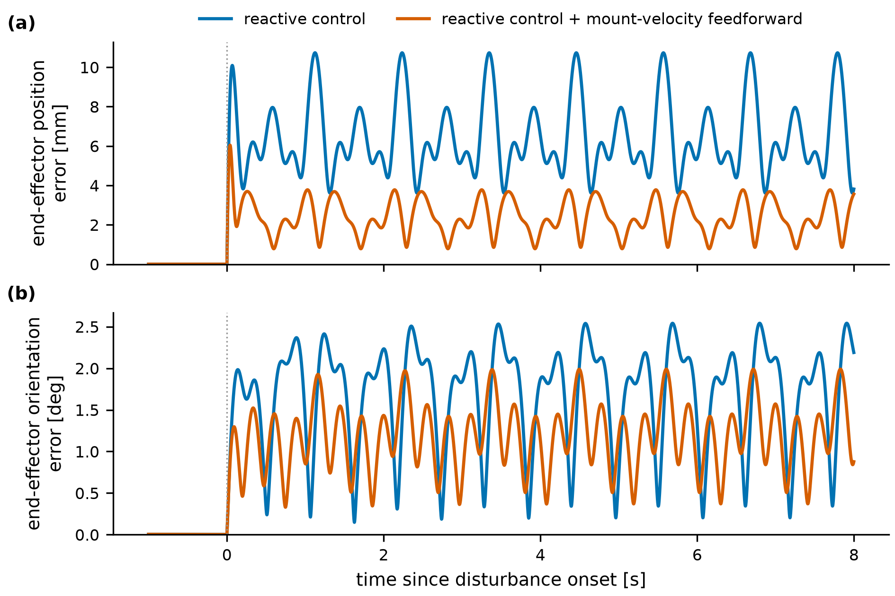

# Holding a robot's hand still while its wearer moves

Christian Akabueze · MSc Human and Biological Robotics, Imperial College London (MUVE Lab) · 2026

Two Kinova Gen3 arms are mounted on a person's torso as supernumerary robotic limbs. When the wearer walks, the mount bounces and sways, and anything the arms hold moves with it. I wanted to know how much of that motion a reactive controller can cancel, so the end-effectors stay fixed in the world rather than on the body.

This repo is the MuJoCo simulation and controller I built for my MSc project, "World-Stable Supernumerary Effectors for Human Augmentation Under Locomotion-Based Motion". I did not build the arms or the mount; the control system is mine.


*Same mount motion in all three columns (f = 1.8 Hz, true amplitude). Top: the whole robot. Middle: a camera fixed in the world at the left arm's target (red sphere). Number: RMS position error of the worse arm since the disturbance started. Strip: that arm's instantaneous error; dashed grey is arms locked. [MP4](media/hold_pose.mp4)*

With the arms locked, the end-effectors move with the mount: 31 mm RMS position error. The reactive controller removes 94% of that at 0.5 Hz and 63% at 3 Hz. At 1.8 Hz, feeding forward the mount velocity cuts the remaining error from 6.7 to 2.6 mm.

## Setup

The mount is a mocap body standing in for the wearer's torso. Both arms are kinematic children of it, and each end-effector has a target pose fixed in the world frame. The mount follows one sinusoid per axis. The amplitudes are hand-chosen to look like walking (a few centimetres of bounce and sway, a few degrees of rotation); this is not a gait model. Bounce, fore-aft and pitch run at f; lateral sway, roll and yaw at f/2, as they would at the stride rate.

| axis | amplitude | frequency |
|---|---|---|
| x (forward) | 8 mm | f |
| y (left) | 22 mm | f/2 |
| z (up) | 20 mm | f |
| roll | 2° | f/2 |
| pitch | 1.3° | f |
| yaw | 3° | f/2 |

Only f changes between runs; the amplitudes stay fixed, so the sweep measures controller bandwidth rather than faster walking. The arms first settle on the static mount, then the disturbance runs for 8 s of simulated time at a 500 Hz control rate. (The Python loop does not run in real time: about 3 ms per cycle.)


*Reactive controller on. Four extreme mount poses of one cycle, and (e) the average over the cycle: the mount and the proximal links blur, the end-effectors stay sharp. The mount motion is enlarged 3x here so it shows in a still; all numbers use the true amplitudes.*

## Controller


*Left of each "|": hardware. Right: simulation.*

Per arm, every 2 ms:

1. Compose the end-effector pose and Jacobian through the mount: world → mount → arm base → end-effector. The pose is never read from MuJoCo directly; on hardware the same code would take the mount pose from Vicon and the joint angles from the encoders (not yet run on hardware).
2. A PD law on the world-frame pose and twist error gives a task-space velocity.
3. Damped least squares maps it to joint velocities, with a null-space term that pulls the joints toward mid-range.
4. A safety filter keeps 13 spheres per arm outside a cylinder around the wearer. Each sphere gets a barrier-style constraint on its distance rate; if the requested joint velocity breaks one, OSQP finds the nearest one that doesn't, within joint speed and position limits ([docs/human-safety.md](docs/human-safety.md)).
5. Integrate to a joint position command for the position servos.

The safety filter never activated in the runs below, so it does not affect the results.

Feedforward adds one term to step 2: the end-effector velocity caused by the mount (the measured total minus the arm's own J q̇), negated. The arm cancels the mount's motion as it happens instead of correcting the error it leaves.

## Results

Position and orientation error RMS over 8 s, worse of the two arms. Locked arms: 31.0 mm and 2.71° at every f.

| f (Hz) | position, reactive (mm) | removed | orientation, reactive (°) | removed | peak joint speed (°/s) |
|---|---|---|---|---|---|
| 0.5 | 1.9 | 94% | 1.24 | 54% | 14 |
| 1.0 | 3.7 | 88% | 1.56 | 42% | 27 |
| 1.5 | 5.6 | 82% | 1.73 | 36% | 40 |
| 2.0 | 7.4 | 76% | 1.85 | 32% | 52 |
| 2.5 | 9.3 | 70% | 1.95 | 28% | 66 |
| 3.0 | 11.3 | 63% | 2.02 | 25% | 80 |


*(a) Vertical mount motion in the slowest and fastest run. (b, c) End-effector error against disturbance frequency. Error bars: SD of the per-period RMS across the complete periods in each run. Open marker: joint-speed limit reached (16% of samples at 3 Hz).*

Position error grows linearly with f. Per axis the position loop is first order, (1 + Kd) ė + Kp e = −v, with Kp = 32 s⁻¹ and Kd = 0.9, so its time constant is 59 ms and it tracks a disturbance with an error proportional to the disturbance velocity. The mount velocity is proportional to f.

Orientation does worse: 54% removed at 0.5 Hz, 25% at 3 Hz. This is not the rotational gain (Kp = 2.1 s⁻¹). At 1.8 Hz, raising it to 12 s⁻¹ only moves the error from 1.79° to 1.69°, and at 16 s⁻¹ the loop goes unstable. Raising every joint servo's gain 4x helps more (1.39° with Kp = 8), which points at servo lag. The wrist servos in the Kinova model are a quarter as stiff as the others, but I have not isolated which joints matter.



*Right arm at f = 1.8 Hz. Position error RMS 6.7 → 2.6 mm, orientation 1.79° → 1.25°. The left arm gives the same numbers to within 0.1 mm.*

Feedforward gets the exact mount velocity in simulation, yet 2.6 mm remains. Most of that is the position servos lagging the command: with the servo gains raised 4x the residual drops to 1.1 mm.

## C++ port

`cpp/` is a C++20 port of the simulation and controller. It reproduces the Python golden trace to 1e-12 over 500 control cycles and a 2,000-cycle headless run with the safety filter enabled (`bash cpp/tools/verify_parity.sh`; results in [cpp/docs/04-parity-report.md](cpp/docs/04-parity-report.md)). It was written before the feedforward term and does not include it.

## Limitations

- The disturbance is a hand-chosen sum of sinusoids, not recorded gait. It is periodic and smooth, which flatters any controller.
- In simulation the feedforward gets the exact mount velocity. On hardware it would come from Vicon, with noise and delay, and the improvement would shrink.
- Joint limits are clamped, not avoided. From a start far from the target (about 24 cm) one arm can drive a wrist joint onto its limit and stall there.
- The arms are position-servoed and rigid: no link flexibility or backlash beyond what MuJoCo models.
- The thesis proposed predictive control (MPC) against this baseline. I did not build it; this repo is the baseline plus the feedforward term.

## Code

| Path | |
|---|---|
| `controller/reactive_controller.py` | The control law in order: errors, PD, feedforward, DLS, null space, safety projection |
| `controller/frames.py`, `pin_fk.py` | World-frame kinematics composed through the mount (Pinocchio FK) |
| `controller/human_safety.py`, `link_spheres.py` | Arm spheres, the wearer cylinder and the distance constraints |
| `controller/runner.py`, `servo.py` | One control cycle; MuJoCo and the planned hardware backend share one interface ([docs/backend-contract.md](docs/backend-contract.md)) |
| `sim/` | MJCF scene, MuJoCo backend |
| `tools/mount_disturbance.py` | The disturbance model, and a viewer that runs it |
| `tools/disturbance_freq_sweep.py` | Frequency sweep (results table and figure) |
| `tools/feedforward_compare.py` | Reactive vs feedforward |
| `tools/gain_sweep.py` | Kp × Kd sweep behind the chosen position gains |
| `tools/make_readme_media.py` | The video above |
| `analysis/` | FK against MuJoCo, end-effector velocity ([docs/velocity-validation.md](docs/velocity-validation.md)), tracking bandwidth, live dashboard |
| `tests/` | 258 unit and closed-loop tests |

Also in the repo, not used for the results: Cartesian target trajectories ([docs/cartesian-trajectories.md](docs/cartesian-trajectories.md)) and a collision-aware path planner above the controller (`planning/`, [docs/planning.md](docs/planning.md)).

Two FK implementations exist on purpose: `pin_fk.py` (Pinocchio) is the control path, `kinematics.py` (analytical, from MuJoCo model constants) cross-checks it. Frames are written `T_A_B`: pose of frame B in frame A. Everything is SI internally; millimetres only in prints and plots.

## Running

Tested on Python 3.14.4 with `mujoco`, `pin`, `numpy`, `scipy`, `osqp`, `matplotlib` (`requirements.txt`; pinned versions in `requirements-lock.txt`). Run from the repo root.

```bash
python -m venv .venv && source .venv/bin/activate
pip install -r requirements.txt

mjpython tools/mount_disturbance.py both      # viewer: arms holding pose on the moving mount (macOS needs mjpython)
python tools/disturbance_freq_sweep.py        # results table and sweep figure
python tools/feedforward_compare.py right --f=1.8
python tools/make_readme_media.py             # the video above
python -m unittest discover tests
```

Gains, limits, targets and the safety envelope are in `config/control.toml`. The Kinova Gen3 model in `sim/assets/kinova_gen3/` is from MuJoCo Menagerie (BSD licence, Kinova). My code is MIT licensed.
