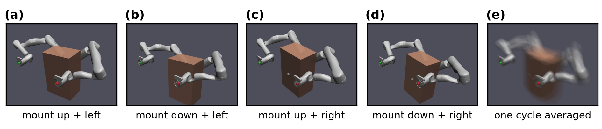
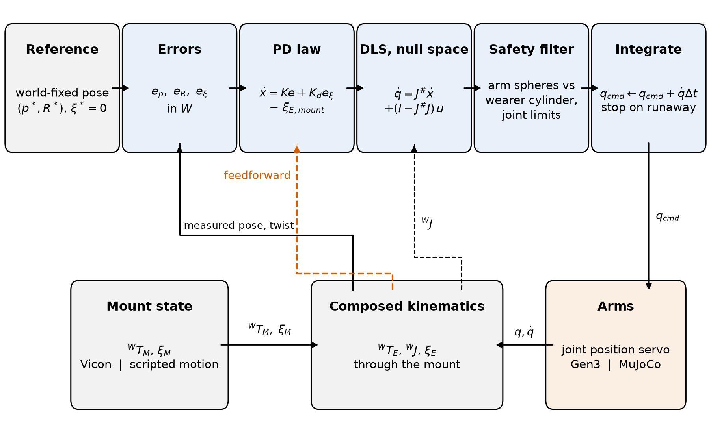
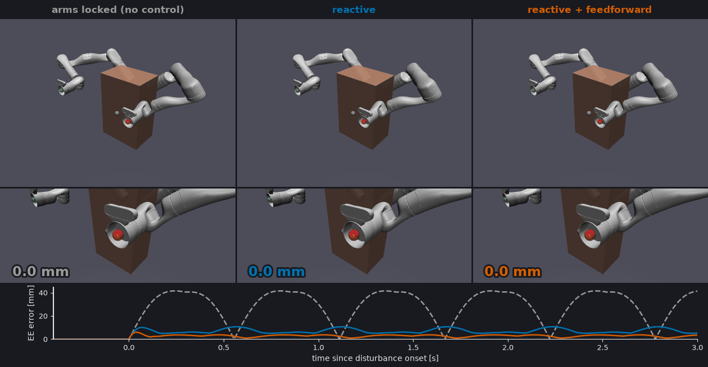
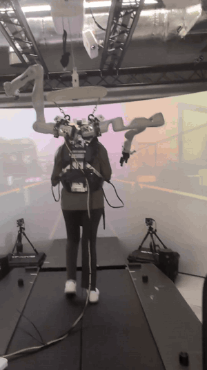
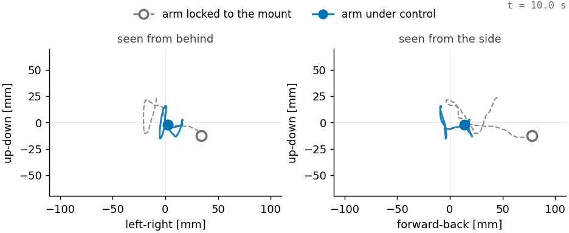

# World-stable end-effectors for wearable robotic arms

MSc thesis: "World-Stable Supernumerary Effectors for Human Augmentation Under Locomotion-Scale Base Motion"

Christian Akabueze · MSc Human and Biological Robotics, Imperial College London (MUVE Lab) · 2026

A controller that keeps the hands of two wearable Kinova Gen3 robot arms fixed in the room while the person wearing them moves.

*The wearer twists about 60°. The elbows swing and the hands stay close to where they were. Phone video from the lab, filmed during setup.*

## Why it is hard

A robot arm you wear is an extra pair of hands, until you take a step. Every step moves the mount on your back that carries the arms, and anything they hold moves with it. The controller has to measure that movement and move the arm against it as it happens.

*The mount in four positions of one walking cycle, with the controller on. In the average (e) the mount and upper arms blur. The hands stay sharp. The mount motion is enlarged 3x here so it shows in a still.*

## How the controller works

For each arm, on every control cycle (500 a second in simulation):

1. Read where the mount on the wearer's back is, from motion capture.
2. Work out where the robot's hand is in the room, through the mount and the arm's joints.
3. Compare that with the point the hand should hold, and compute joint speeds that close the gap.
4. Check the arm stays clear of the wearer. If a move would bring it too close, swap it for the nearest safe one.
5. Send the command to the arm.

*The same loop as a diagram. The dashed orange path is feedforward: telling the controller how the mount is moving, so it cancels the motion instead of chasing the error it leaves.*

## In simulation

*The same mount motion three times: arms locked, the controller, and the controller with feedforward. The number is how far the hand strays from its target.*

## On the real arms

Seven people walked on a treadmill wearing the arms.

| Walking speed | Movement removed |
|---|---|
| Slow (0.5 m/s) | 71% |
| Normal (1.0 m/s) | 63% |
| Fast (1.5 m/s) | 56% |

These are averages over six of the seven. The [hardware page](docs/hardware-trials.md) has the detail.

Slow sway is mostly removed. The bounce of each step is harder, because the arm learns how the wearer is moving 61-71 ms late.

*One trial at normal walking speed. Grey is where the hand would have gone with the arm locked. Blue is where it went.*

## What I would do next

- Speed up the motion sensing. In simulation, adding feedforward with no delay cuts the error from 6.7 mm to 2.6 mm.
- Run feedforward on the real arms, then test both arms at once.

## Read more

- [Hardware trials](docs/hardware-trials.md): how a trial is scored, results by speed and frequency, and what limits the arm.
- [Simulation](docs/simulation.md): the delay experiment, the controller in detail, and the frequency sweep.
- [Scope and next steps](docs/scope-and-next-steps.md): what these results cover and what comes next.
- [Code map](docs/code-map.md): where things live in the repo, and how to run it.

## Contact

For questions about the project or the code, [open an issue](https://github.com/fechachris4/msc_project/issues) or email fecha412@gmail.com.
