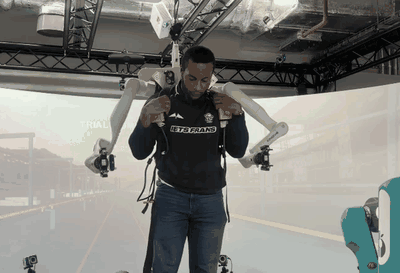
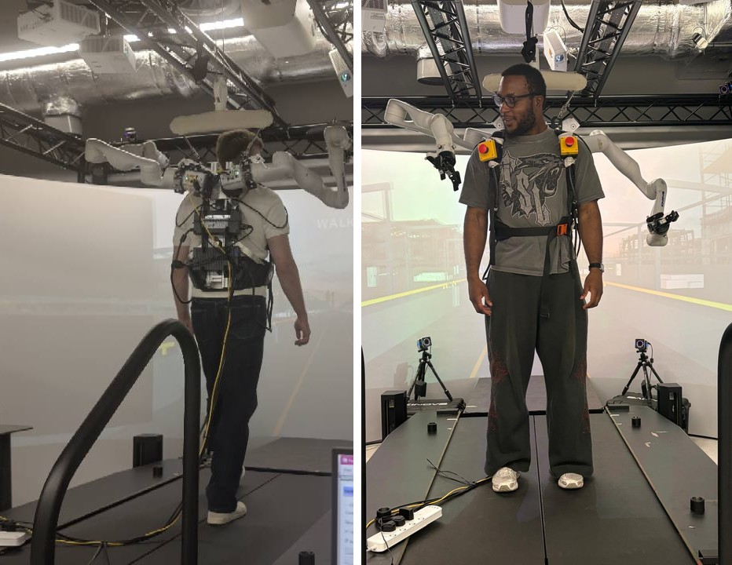

# World-stable end-effectors for wearable robotic arms

[](https://github.com/fechachris4/msc_project/actions/workflows/tests.yml)

MSc thesis: "World-Stable Supernumerary Effectors for Human Augmentation Under Locomotion-Scale Base Motion"

Christian Akabueze · MSc Human and Biological Robotics, Imperial College London (MUVE Lab) · 2026

A robot arm you wear is an extra pair of hands, until you take a step. Every step moves the mount on your back that carries the arms, and anything they hold moves with it. My MSc project asked how much of that motion two Kinova Gen3 arms worn on the back can cancel, so their end-effectors (the robot's hands) stay fixed in the room rather than on the body.

<p align="center"></p>

*Phone video from the lab, stabilised on the background. Filmed during setup with the controller holding position, not a recorded trial. The wearer twists his torso by about 60°; the elbows swing, while the end-effectors move much less than the torso.*

Seven participants walked on a treadmill while the arms held a fixed point in the room. At a normal walking speed (1.0 m/s) the arms cut the movement reaching the robot's hands by 63%. That is the average over six of the seven; the first session is reported separately. Slow sway was mostly removed. The faster bounce that comes with each step largely was not.

The likely cause is timing. The arm learns how the wearer is moving 61-71 ms late. In simulation, a delay of that size wipes out the gain from correcting for the wearer's movement. So the next thing to improve on hardware is how fast the arm senses that movement.



*The rig. Left: a participant walking on the treadmill with both arms on. Right: the same rig from the front. Vicon cameras on the truss and on tripods track the mount and the end-effectors.*

## Read more

- [Hardware trials](docs/hardware-trials.md): how a trial is scored, results by speed and frequency, and what limits the arm.
- [Simulation](docs/simulation.md): the delay experiment, how the controller works, and the frequency sweep.
- [Scope and next steps](docs/scope-and-next-steps.md): what these results cover and what comes next.
- [Code map](docs/code-map.md): where things live in the repo.

## About the code

- **In this repo:** the MuJoCo simulation and controller I built for the project, a C++20 port of them in [`cpp/`](cpp/README.md), and the scripts behind the hardware figures.
- **Not in this repo:** the controller that ran on the robot, which lives on the MUVE Lab machine, and the participant data. Neither is public.
- **Borrowed:** the Kinova Gen3 arm model, from MuJoCo Menagerie.

## Run the simulation

Run from the repo root.

```bash
python -m venv .venv && source .venv/bin/activate
pip install -r requirements.txt

mjpython tools/mount_disturbance.py both   # viewer (mjpython on macOS)
python -m unittest discover tests
```

The commands that regenerate each figure are in the [code map](docs/code-map.md#regenerating-the-figures).

My code is MIT licensed. The Kinova Gen3 model is from MuJoCo Menagerie (BSD licence, Kinova).

## Contact

For questions about the project or the code, [open an issue](https://github.com/fechachris4/msc_project/issues) or email fecha412@gmail.com.
