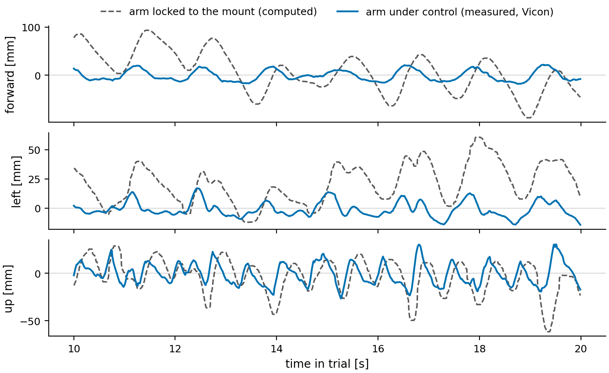
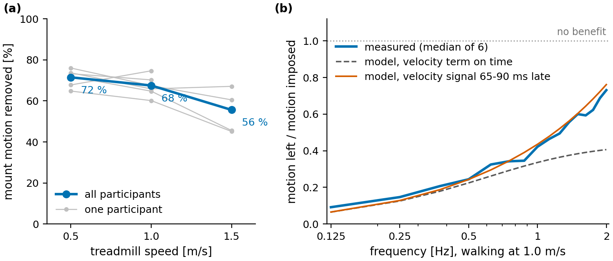

# Hardware trials

The full hardware analysis behind the summary in the [README](../README.md). The thesis is under examination; I will link it once it is marked.

Terms used here: the **mount** is the plate on the wearer's back that carries the arms. An **end-effector** is the tip of an arm, the robot's hand. The **locked point** is where the end-effector would be if the arm were rigid and simply rode along with the mount.

Seven participants wore the arms on an instrumented treadmill and walked at 0.5, 1.0 and 1.5 m/s. The first session is reported separately and is not in the pooled numbers, so the means are over six participants (four of them at 1.5 m/s). Five also stood on the treadmill platform while it pitched and swayed. Most trials ran one arm at a time (19 of 128 walking trials had both arms servoing), so these are one-arm results.

*The first seconds of a trial, filmed from behind on a phone: a participant walks on the treadmill with both arms on.*

The arms ran a 400 Hz world-frame Cartesian controller, with a Kalman filter estimating the mount pose and velocity from Vicon. It had no mount-velocity feedforward; its velocity term was the K_d gain on the world-frame velocity error. That controller runs on the MUVE Lab machine and is not public. The analysis is mine. Participant data are not public, so the repo has the figures and the scripts that drew them (`tools/hardware_figures.py`, `tools/hardware_replay.py`), not the data.

To score a trial I compare two things: where Vicon saw the end-effector go, and where it would have gone if the arm were locked to the mount. The second is computed by carrying the end-effector point along with the measured mount pose. That model checks out: on arms that were not being controlled, it predicts their motion to within 0.5% (median over 126 arms). The ratio of the two motions is the share of mount motion left over, and one minus that is the share removed. Every percentage on this page is the share removed.

*One trial at 1.0 m/s, 10 s of it (participant P6, left arm; of that participant's trials, the one closest to their median). Dashed: the end-effector if the arm were locked to the mount, lightly median-filtered for display. Solid: the end-effector as measured. Both are centred on their mean over the trial, so the constant offset to the goal (see below) is removed. All three panels share one scale.*

In this trial the forward and sideways sway, which repeat once per stride, are mostly cancelled. The vertical bounce, which comes twice per stride, is the harder component and the next target. Here are the same 10 s replayed at real speed:

*Hollow grey: the end-effector if the arm were locked to the mount (median-filtered, as above). Blue: the end-effector as measured. Tails show the last second.*

Across participants the frequency response shows the same split:

*(a) Share of mount motion removed over the whole trial, by treadmill speed. The blue line is a geometric mean of the motion left over, so it reads a few points higher than the arithmetic means quoted in the text (71, 63 and 56%). (b, c) Amplitude and phase of the end-effector motion relative to the mount motion (lower amplitude means more removed), at 1.0 m/s, median of 6 participants. Green: the logged gains with the mount-velocity signal arriving late, by a delay fitted per participant (65-90 ms). Using the measured 61-71 ms instead gives almost the same curve. Above 2 Hz the locked-arm estimate is not accurate enough to interpret.*

At 1.0 m/s the arm removes 85% of the motion at 0.25 Hz, 58% at 1 Hz and 29% at 2 Hz. Walking moved the locked point 63-68 mm RMS at every speed; faster walking moved it faster, not further. Around a constant offset of 18-21 mm, the end-effector moved 16.9 mm RMS at 0.5 m/s, 20.8 mm at 1.0 m/s (five participants) and 27.8 mm at 1.5 m/s (three). On the pitching and swaying platform the arm removed 78% (five participants): the pitch steps moved the locked point 94 mm RMS and the end-effector 14 mm, the sway steps 81 mm and 17 mm.

## What sets the limit, and how to raise it

- **The velocity term has the most headroom.** With the logged gains, the ideal model (dash-dot in b and c) predicts stronger rejection above 0.5 Hz than the arm reached, and the model without a velocity term (dotted) matches the measured amplitude. In a pilot session with one wearer, K_d was stepped from 0.8 to 2.6: the response near 1 Hz fell by 9%, against 38% predicted.
- **The explanation that fits: the mount velocity arrives late.** The Kalman estimate that feeds the velocity term lags the mount's motion by 36-46 ms. Adding the sensing age (about 10 ms) and the joint response time (about 15 ms) gives 61-71 ms in total. With that measured delay and nothing fitted, the model reproduces the response in amplitude and phase, better than the no-velocity-term model in 6 of 6 participants; the two differ mainly in phase (c, which shows the fitted version). Confirming it directly means changing the estimator on hardware, which is the next experiment.
- **Re-planning.** In 12 of 128 walking trials the hardware controller's motion planner moved the arm's reference more than 100 mm from the target, and those trials had the largest end-effector motion. In those trials the reference itself moved, so the fix is a planner setting.
- **Wrist speed at the fastest walk.** At 1.5 m/s a commanded joint speed was at its limit 32% of the time, mostly in the wrist, against about 10% at the slower speeds.
- **Absolute accuracy is set by calibration.** The end-effector sat a constant 18-21 mm from its goal. Arm by arm, that offset follows the disagreement between the arm's kinematic model and Vicon (the two differ by 1.6 ± 5.5 mm over seven arms), so it comes from calibration.
