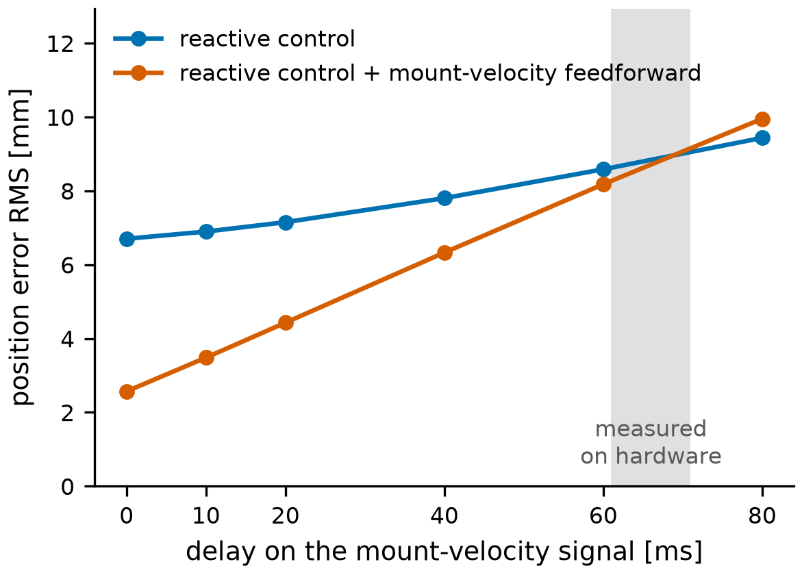
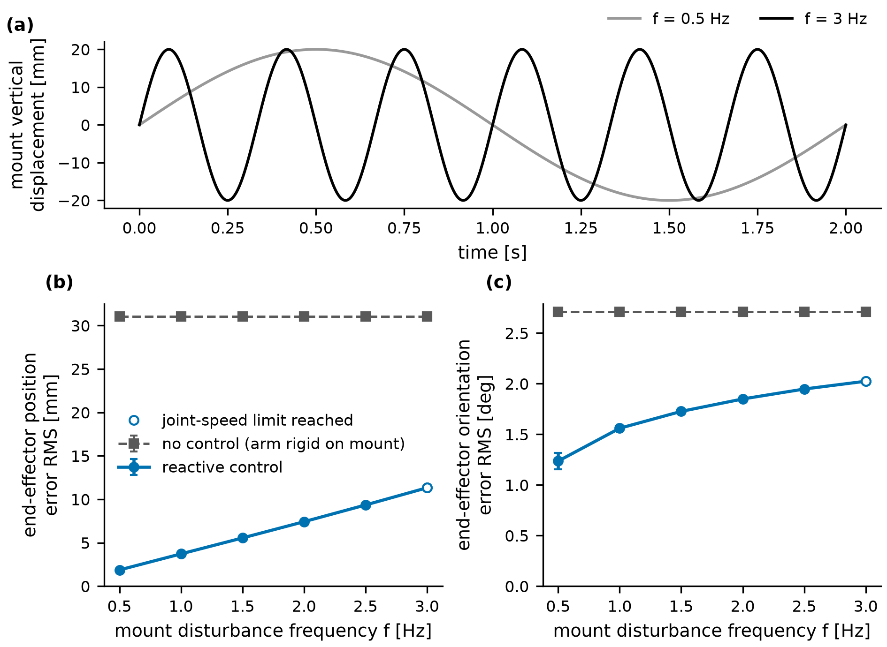

# Simulation

The simulation detail behind the summary in the [README](../README.md): the delay experiment, how the simulation and controller work, and the frequency sweep.

Symbols used here: **f** is the frequency of the mount's bounce, in Hz (walking steps come at roughly 1.8 Hz). **K_p** and **K_d** are the controller's gains on position error and velocity error. **Feedforward** means subtracting the motion the mount is about to cause, instead of waiting for the error to appear.

The [hardware trials](hardware-trials.md) left one question open: if the mount velocity arrived on time, how much would the velocity terms help? In simulation the velocity is exact, and I can delay it on purpose.

## A late velocity signal

`tools/velocity_delay.py` runs the disturbance below at f = 1.8 Hz and delays the mount part of the measured end-effector velocity by up to 80 ms before the controller sees it. The arm's own part (J q̇) stays current, as on hardware. Three controllers: no velocity term, the K_d term alone (as on hardware), and the K_d term plus feedforward. Feedforward is a simulation-only term: the controller subtracts the end-effector velocity the mount causes from its command, so the arm cancels the mount's motion as it happens instead of correcting the error it leaves.

*Right arm at f = 1.8 Hz. Grey band: the 61-71 ms measured on the hardware's mount-velocity path.*

With the exact velocity, the K_d term alone gives 6.7 mm against 7.5 mm with no velocity term, and feedforward brings it to 2.6 mm. Each 10 ms of delay costs the feedforward about 1 mm. Past about 30 ms the K_d term does worse than no velocity term at all; past about 45 ms the feedforward does worse than the K_d term with an exact velocity. At 60 ms both sit at 8.2-8.6 mm.

Why delay matters this much: an estimate that is d seconds late cancels the true velocity only up to a phase error, and what is left over is |1 − e^(−jωd)| = 2 sin(ωd/2) of it. At 1.8 Hz and 60 ms that is two thirds; at 0.9 Hz, a third. For the feedforward that is the whole story. The K_d term sits inside the feedback loop, so what a delay costs it also depends on the gains: in the simulation it ends up slightly worse than no velocity term, while on hardware the response sits about at the no-velocity-term model.

The simulation shows that a delay of the size measured on hardware is enough on its own to remove the benefit of a velocity term, consistent with the hardware diagnosis.

## How the simulation works

*Same mount motion in all three columns (f = 1.8 Hz, true amplitude). Top: the whole robot. Middle: a camera fixed in the world at the left arm's target (red sphere). Number: RMS position error of the worse arm since the disturbance started (the clip is 2.3 s including the onset transient; the full 8 s values are 31.0, 6.7 and 2.6 mm). Strip: that arm's instantaneous error; dashed grey is arms locked. [MP4 version](../media/hold_pose.mp4)*

With the arms locked, the end-effectors move with the mount: 31 mm RMS position error. The reactive controller (the PD law with the K_d term, no feedforward) removes 94% of that at 0.5 Hz and 63% at 3 Hz.

The mount is a mocap body standing in for the wearer's torso. Both arms are kinematic children of it, and each end-effector has a target pose fixed in the world frame. The mount follows one sinusoid per axis. The amplitudes are hand-chosen to look like walking (a few centimetres of bounce and sway, a few degrees of rotation), a controlled stand-in for gait. Bounce, fore-aft and pitch run at f; lateral sway, roll and yaw at f/2, once per stride, as in walking.

| axis | amplitude | frequency |
|---|---|---|
| x (forward) | 8 mm | f |
| y (left) | 22 mm | f/2 |
| z (up) | 20 mm | f |
| roll | 2° | f/2 |
| pitch | 1.3° | f |
| yaw | 3° | f/2 |

Only f changes between runs; the amplitudes stay fixed, so the sweep measures controller bandwidth rather than faster walking. The arms first settle on the static mount, then the disturbance runs for 8 s of simulated time at a 500 Hz control rate. (The Python loop takes about 3 ms per cycle, so runs are offline.)

*Reactive controller on. Four extreme mount poses of one cycle, and (e) the average over the cycle: the mount and the proximal links blur, the end-effectors stay sharp. The mount motion is enlarged 3x here so it shows in a still; all numbers use the true amplitudes.*

### Controller

*Left of each "|": the hardware interface this code is written against. Right: simulation.*

Per arm, every 2 ms:

1. Compose the end-effector pose and Jacobian through the mount: world → mount → arm base → end-effector. The pose is never read from MuJoCo directly; on hardware the same code would take the mount pose from Vicon and the joint angles from the encoders.
2. A PD law on the world-frame pose and twist error gives a task-space velocity. Feedforward, when on, adds the negated mount-induced end-effector velocity (the measured total minus the arm's own J q̇).
3. Damped least squares maps it to joint velocities, with a null-space term that pulls the joints toward mid-range.
4. A safety filter keeps 13 spheres per arm outside a cylinder around the wearer. Each sphere gets a barrier-style constraint on its distance rate. If the requested joint velocity violates any of them, OSQP finds the closest joint velocity that satisfies all of them and the joint speed and position limits ([docs/human-safety.md](human-safety.md)).
5. Integrate to a joint position command for the position servos.

The safety filter stayed inactive in these runs, so the results reflect the controller alone. The gains are stiffer than on hardware (K_p = 32 s⁻¹ and K_d = 0.9 here; 12 s⁻¹ for most hardware arms, range 10-16, with K_d 1.0-1.6), so the two agree in trend and should not be compared millimetre for millimetre.

### Frequency sweep

Position and orientation error RMS over 8 s, worse of the two arms. Locked arms: 31.0 mm and 2.71° at every f.

| f (Hz) | position, reactive (mm) | removed | orientation, reactive (°) | removed | peak joint speed (°/s) |
|---|---|---|---|---|---|
| 0.5 | 1.9 | 94% | 1.24 | 54% | 14 |
| 1.0 | 3.7 | 88% | 1.56 | 42% | 27 |
| 1.5 | 5.6 | 82% | 1.73 | 36% | 40 |
| 2.0 | 7.4 | 76% | 1.85 | 32% | 52 |
| 2.5 | 9.3 | 70% | 1.95 | 28% | 66 |
| 3.0 | 11.3 | 63% | 2.02 | 25% | 80 |

*(a) Vertical mount motion in the slowest and fastest run. (b, c) End-effector error against disturbance frequency. Error bars: SD of the per-period RMS across the complete periods in each run. Open marker: joint-speed limit reached (16% of samples at 3 Hz).*

Position error grows roughly linearly with f, as on hardware. Ignoring servo lag, each position axis is first order: (1 + K_d) ė + K_p e = −v, where e is the end-effector position error and v the velocity the mount imposes on it. With K_p = 32 s⁻¹ and K_d = 0.9 the time constant is 59 ms (corner 2.7 Hz). Below the corner the error is roughly v / K_p, and v grows with f.

Orientation is the harder axis: 54% removed at 0.5 Hz, 25% at 3 Hz. At 1.8 Hz the rotational gain K_R (2.1 s⁻¹) is not the limit: raising it to 12 s⁻¹ only moves the error from 1.79° to 1.69°, and at 16 s⁻¹ the loop goes unstable. Raising every joint servo's gain 4x does more (1.39° with K_R = 8), which points at servo lag. The wrist servos in the Kinova model are a quarter as stiff as the others; isolating which joints matter is the next step.

Feedforward with the exact velocity also cuts orientation error at 1.8 Hz, from 1.79° to 1.25°, and the left arm gives the same position numbers as the right to within 0.1 mm (`tools/feedforward_compare.py`). The 2.6 mm it leaves is mostly the position servos lagging the command: with the servo gains raised 4x it drops to 1.1 mm.
